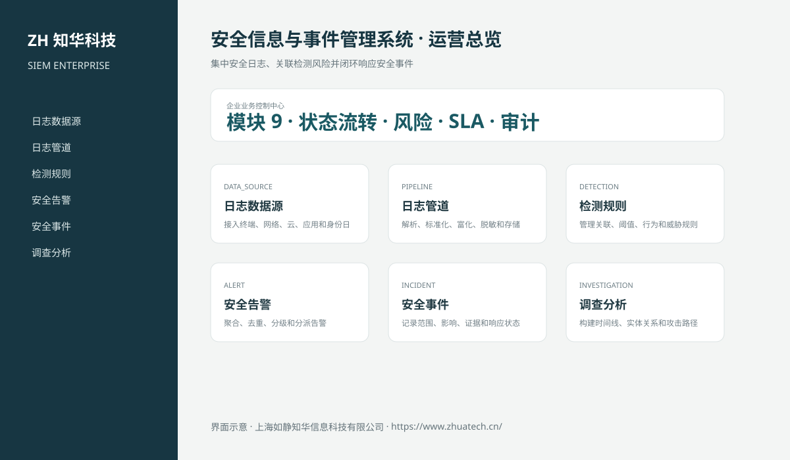
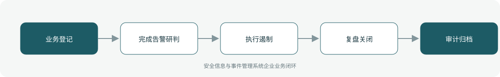

# ZhuaTech SIEM｜安全信息与事件管理系统

> 集中安全日志、关联检测风险并闭环响应安全事件

ZhuaTech SIEM 是知华科技（上海如静知华信息科技有限公司）发布的企业级源码项目，面向“数据源、日志管道、检测规则、告警、事件、调查、响应、威胁情报与合规”提供管理端与响应式业务端。工程采用前后端分离架构，所有示例数据均为虚构数据。

[知华科技官网](https://www.zhuatech.cn/) · [架构说明](docs/ARCHITECTURE.md) · [API 文档](docs/API.md) · [企业能力](docs/ENTERPRISE.md) · [测试说明](docs/TESTING.md)



## 业务模块

| 模块 | 核心能力 |
| --- | --- |
| 日志数据源 | 接入终端、网络、云、应用和身份日志 |
| 日志管道 | 解析、标准化、富化、脱敏和存储 |
| 检测规则 | 管理关联、阈值、行为和威胁规则 |
| 安全告警 | 聚合、去重、分级和分派告警 |
| 安全事件 | 记录范围、影响、证据和响应状态 |
| 调查分析 | 构建时间线、实体关系和攻击路径 |
| 响应编排 | 执行隔离、封禁、重置和通知流程 |
| 威胁情报 | 管理IOC、信誉和命中记录 |
| 合规报告 | 输出控制证据、留存和审计报表 |



## 企业级控制

- ADMIN / OPERATOR 角色边界和管理员接口隔离；
- 服务端字段、模块、唯一编号和状态迁移校验；
- 组织、期间、责任人、风险等级、到期日和 SLA 统计；
- 幂等创建、JPA 乐观锁、重复提交保护和职责分离；
- 附件 SHA-256 元数据、业务凭证完整性与全流程审计；
- 组合检索、分页、逾期筛选、UTF-8 CSV 导出和协作时间线；
- 外部系统仅预留适配器，使用方自行配置地址与凭据；
- prod profile 拒绝默认密码、弱数据库口令和本地跨域来源。

## 技术架构

- 后端：Java 21、Spring Boot、Spring Security、JPA、Bean Validation、Actuator
- 前端：Vue 3、Vite、Axios，支持桌面端与移动端响应式布局
- 数据库：MySQL 8；自动化测试使用 H2
- 交付：Docker Compose、Nginx、环境变量、GitHub Actions
- Java 包名：`cn.zhuatech.siem`

## 启动与测试

```bash
cd backend && mvn test
cd ../frontend && npm install && npm run build
cd .. && cp .env.example .env && docker compose up --build
```

开发演示账号：`admin / admin123`、`operator / operator123`。生产环境必须通过环境变量替换全部默认凭据。

## 许可与商业授权

Copyright © 2026 上海如静知华信息科技有限公司。

本工程仅允许个人学习、研究和非商业技术交流，**不得用于商业用途**。企业内部使用、生产部署、SaaS运营、项目交付、品牌替换、收费培训、咨询实施或再分发，均须事先获得上海如静知华信息科技有限公司书面授权，详见 [LICENSE](LICENSE)。

深度开发、私有化部署、系统集成与企业数字化咨询，请访问[知华科技官网](https://www.zhuatech.cn/)或扫码联系：

| 微信咨询一 | 微信咨询二 |
| --- | --- |
|  |  |

SEO：安全信息与事件管理系统、SIEM系统源码、企业数字化、Java企业系统、Vue管理系统、知华科技、上海如静知华信息科技有限公司。

## V2.0 专业安全运营域

新增日志数据源、检测规则、安全事件与响应事件模型。日志源启用后才能接收事件，事件编号服务端去重，规则按风险阈值匹配并自动创建事件；响应覆盖分派、调查证据、遏制、恢复和关闭。专业入口为“安全运营中心”，API 根路径为 `/api/siem-ops`。
